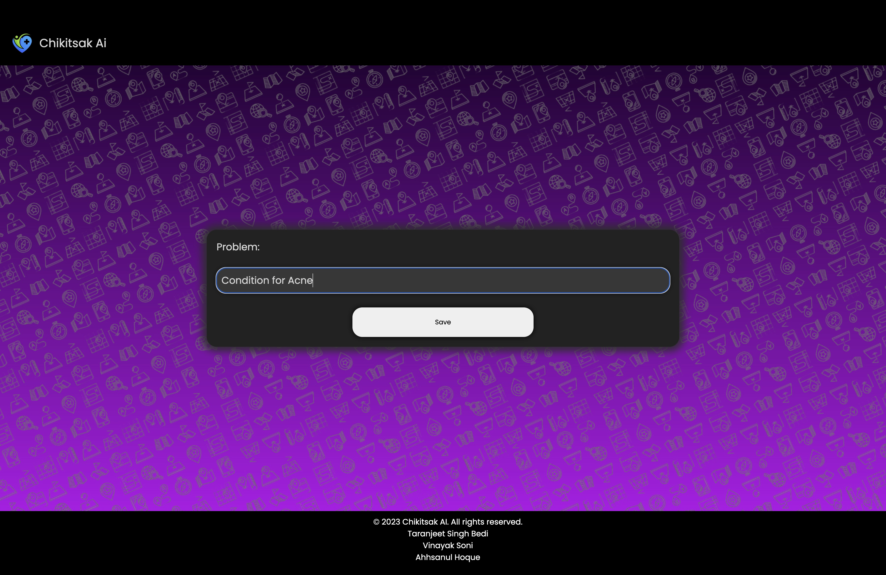
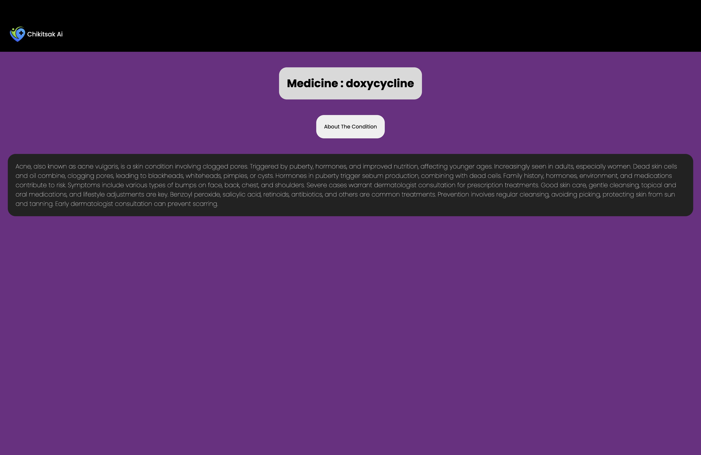

<h1>Chikitsak Ai</h1>

We can use this website to find the proper medicine and the conditions for the specified medical problem.
<h2>General Information</h2>

<ul>
<li>This has a dataset of values, from which the user can find and enter the specific problem and get the best medicine and the about the medical conditions from that.</li>
</ul><ul>
<li>It solves the problem of not having unified results from different website searches and just returns a single general medicine for that problem.</li>
</ul><ul>
<li>It can be used as early solution to check for the problem without the need to consult a doctor.</li>
</ul><h2>Technologies Used</h2>

<ul align="center">
 

 
 
</ul><h2>Features</h2>

<ul>
<li>Big Dataset</li>
</ul><ul>
<li>Mobile Responsive</li>
</ul><ul>
<li>Interactive commands</li>
</ul><h2>Screenshots</h2>

<h2>Setup</h2>

Required Installation: Check the requirements.txt
<h5>Steps</h5><ul>
<li>To download <code>git clone https://github.com/TartejBrothers/ChikitsakAI</code></li>
</ul><ul>
<li>To run <code>cd ChikitsakAi django manage.py runserver</code></li>
</ul><h2>Project Status</h2>

It is completed and hosted at https://chikitsakai.vercel.app/
<h2>Improvements</h2>

<ul>
<li>UI of the home page</li>
</ul><ul>
<li>Bigger dataset</li>
</ul><ul>
<li>UI for the result page</li>
</ul><h2>Features that can be added</h2>

<ul>
<li>Voice dictation</li>
</ul><ul>
<li>Consult a doctor</li>
</ul><h2>Contact</h2>

